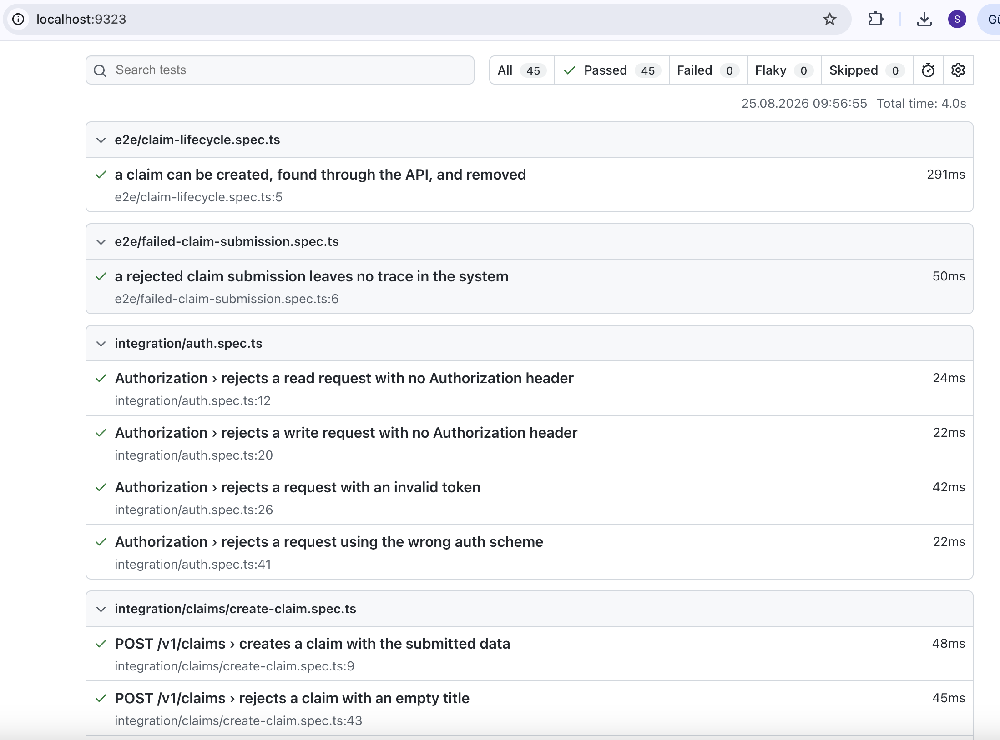

# Claim Service API Tests

Automated test suite for the Claim Service API, written with Playwright and TypeScript. Black-box API tests only.

All 5 `/v1/claims` endpoints (create/get/list/update/delete) are covered, plus auth, malformed-request, idempotency, and concurrency checks, plus two e2e flows (one successful, one rejected) — 45 tests in total. So far the suite found 10 real bugs and 6 design observations — see "Bugs Found" and "Design Observations" below.

Every assertion is based on the live API's real behavior, checked by hand before being written — never assumed from the Swagger spec. See [CONTRIBUTING.md](CONTRIBUTING.md) for how to extend the suite the same way.

- **API structure, endpoints, and assumptions:** [docs/API_UNDERSTANDING.md](docs/API_UNDERSTANDING.md)
- **Full enumerated test case list:** [docs/TEST_CASES.md](docs/TEST_CASES.md)

## Setup

**Install (one command):**

```bash
npm install
```

**Configure your environment:**

```bash
cp .env.example .env   # fill in your API_KEY
```

`.env.example` is the committed template with the required variables (`API_BASE_URL`, `API_KEY`). `.env` is your local copy with real values, and it's git-ignored (see `.gitignore`), so it never gets committed or shared. The API key is never hardcoded: `config/env.ts` reads both variables from `.env` and throws a clear error naming the missing one, pointing back at `.env.example`. The Playwright config attaches the key as a Bearer token to every request automatically.

**Run the tests:**

```bash
npx playwright test
npm run test:report    # open the latest HTML report
```

**Run the linter (and other code-quality checks):**

```bash
npm run lint            # ESLint — npm run lint:fix for autofixable issues
npm run typecheck       # TypeScript
npm run format:check    # Prettier — npm run format to apply
```

All three run in CI on every push and must pass clean.

**CI setup.** `.github/workflows/api-tests.yml` runs on every push to `main`, every pull request into `main`, daily on a schedule, and on manual dispatch. It needs two things set in the repo (Settings → Secrets and variables → Actions): a repository **variable** named `API_BASE_URL` (same value as your local `.env`) and a repository **secret** named `CLAIM_API_KEY` (kept as a secret, not a variable, since it's sensitive). Without these, the workflow fails at the "Run API tests" step with the same missing-env-var error `config/env.ts` throws locally.

**Job summary, no artifact download needed.** The full HTML report is still uploaded as an artifact for deep-diving a failure, but a pass/fail/known-bug breakdown is also written straight to the GitHub Actions run's job summary (`scripts/write-ci-summary.mjs`, reading the `json` reporter's `playwright-report/results.json`) — so a reviewer sees the state of the suite on the Actions run page itself, without downloading anything.

**Run in Docker.** `Dockerfile` builds on [Playwright's official image](https://mcr.microsoft.com/en-us/product/playwright/about), matching the `@playwright/test` version in `package.json`, so the suite runs the same way no matter what's installed locally. Credentials still come from the environment, not the image:

```bash
docker build -t claim-service-api-tests .
docker run --rm --env-file .env claim-service-api-tests
```

CI runs this same image in a separate `docker` job in `.github/workflows/api-tests.yml`, next to the native `test` job.

## Demo

A recording of a full test run and its Playwright HTML report (`npm run test:report`) — 45 tests, all passing.

▶️ [Watch the demo recording](docs/claim-api-demo.mov)



## Project Structure

```
claim-service-api/
├── .github/workflows/api-tests.yml   # CI workflow (push/manual/daily), incl. a Docker-based job
├── Dockerfile                        # runs the suite on Playwright's official image
├── CONTRIBUTING.md                   # how to add a new test
├── docs/
│   ├── API_UNDERSTANDING.md          # API structure, endpoints, assumptions
│   ├── TEST_CASES.md                 # enumerated list of all 45 test cases
│   └── claim-api-demo.mov            # test run + report recording (see "Demo" above)
├── config/
│   └── env.ts                        # reads base URL + API key from .env
├── api/
│   ├── clients/
│   │   ├── BaseApiClient.ts          # wraps Playwright's request context: get/post/patch/delete
│   │   └── ClaimsClient.ts           # typed methods for every /v1/claims endpoint
│   └── types/
│       ├── claim.types.ts            # Claim/ListClaimsResponse zod schemas (+ inferred types), request types
│       └── common.types.ts           # RpcStatus/UnauthorizedErrorBody zod schemas, ValidationCase<T>
├── fixtures.ts                       # claimsClient (auto-cleanup) + unauthenticatedClaimsClient fixtures
├── utils/
│   ├── pollUntil.ts                  # generic polling helper for endpoints that settle asynchronously
│   └── testData/
│       └── claims.ts                 # faker-based payload builders
├── tests/
│   ├── e2e/                          # a few tests, each covering one full business flow end-to-end
│   └── integration/                  # many tests, each covering one endpoint/behaviour in isolation
│       ├── auth.spec.ts                  # 401 scenarios, cross-cutting (uses unauthenticatedClaimsClient)
│       ├── claims/                       # per-endpoint tests (create-claim.spec.ts, ...)
│       ├── contract/                     # cross-cutting checks: undocumented/edge behaviour, not tied to one endpoint
│       └── errors/                       # cross-cutting HTTP-framing errors: malformed JSON, Content-Type
├── scripts/
│   └── write-ci-summary.mjs          # turns the json reporter's output into the CI job summary
├── eslint.config.mjs                 # ESLint (typescript-eslint + eslint-plugin-playwright)
├── .prettierrc.json                  # Prettier formatting rules
├── playwright.config.ts
├── package.json
└── tsconfig.json
```

See [CONTRIBUTING.md § Conventions](CONTRIBUTING.md#conventions) for the rules behind this layout (typed API clients, the integration/e2e split, path aliases).

## Test Strategy

**No hardcoded data.** Request payloads come from factory functions in `utils/testData/`, built on `@faker-js/faker` (e.g. `validCreateClaimPayload()`) — not literal strings in spec files. `Partial<Record<keyof T, unknown>>`-typed `overrides` let a test build a deliberately invalid payload (wrong type, empty value, etc.) through the same factory.

**No hardcoded waits.** If an endpoint settles asynchronously, wait for it with `utils/pollUntil.ts` (or Playwright's built-in polling assertions) — never a fixed `sleep`. `POST /v1/claims` turned out to be synchronous (no "processing" state), so no test needs this yet, but it's ready for the next endpoint that does.

**Runtime schema validation, not just compile-time casts.** `api/types/claim.types.ts` and `common.types.ts` define [zod](https://zod.dev) schemas (`ClaimSchema`, `ListClaimsResponseSchema`, `RpcStatusSchema`, `UnauthorizedErrorBodySchema`), plus the TS types inferred from them. Happy-path and design-observation tests call `Schema.parse(await response.json())` instead of `const x: Claim = await response.json()`. The plain cast only checks types at compile time — it trusts the response blindly. If the real API's shape ever changed (a field renamed, a type changed), a test using a plain cast would keep "passing" unless it happened to check that exact field. `.parse()` turns contract drift into a real, immediate test failure instead of silent staleness. (The `test.fail()` bug-regression tests keep the plain cast on purpose — they're reading a resource already known to be in a wrong _state_, not checking its _shape_.)

**Auto-cleanup.** The `claimsClient` fixture in `fixtures.ts` is backed by a `TrackingClaimsClient`. It records every claim id it creates (through any create-like method, including the raw escape hatch below) and deletes them all when the test ends — so the shared test environment doesn't collect leftover data and tests don't need manual cleanup code.

**Single worker, on purpose.** `playwright.config.ts` sets `workers: 1` and `fullyParallel: false` everywhere, not just in CI. Every test hits one real, shared, mutable API — no mocks — so two tests running at the same time could race each other (e.g. one test reads a total, then reads it again expecting the same number, while another test creates a claim in between). Running tests strictly one at a time costs a little speed (41 tests take ~3.5s instead of ~2s) but removes that whole class of flaky failures. Tests still can't control _external_ actors on the shared environment (another person, another session), so most assertions check for inclusion (`.some((c) => c.id === created.id)`) rather than exact counts wherever that's possible — see the "design observations" in `tests/integration/claims/list-claims.spec.ts` for an example.

**Table-driven negative tests.** `ValidationCase<T>` from `@api/types/common.types` is used for "invalid input → expected error" cases (see `tests/integration/claims/create-claim.spec.ts`).

**Testing auth failures.** `fixtures.ts` also exposes `unauthenticatedClaimsClient` — a `ClaimsClient` backed by a fresh request context with no `Authorization` header — for testing what happens when auth is missing. For other broken-auth cases (wrong scheme, invalid token), a one-off context is built inline with `playwright.request.newContext(...)` (see `tests/integration/auth.spec.ts`).

**Testing malformed requests.** `ClaimsClient.createClaimRaw(body, headers?)` is a typed escape hatch for negative tests that need to skip the normal request-shape typing — for example, a raw malformed-JSON string, or a header override like a non-JSON `Content-Type` (see `tests/integration/errors/common.spec.ts`). Every other test should use the normal typed methods; this one exists only for cases where "wrong shape" is the point of the test.

## Bugs Found

While building the suite, I found **10 real, reproducible bugs**: 5 in `PATCH /v1/claims/{id}` (`tests/integration/claims/update-claim.spec.ts`), 4 in `GET /v1/claims` (`tests/integration/claims/list-claims.spec.ts`), and 1 in `GET /v1/claims/{id}` (`tests/integration/claims/get-claim.spec.ts`). Each one is written as a `test.fail()` test, with its title prefixed `BUG: `. The suite stays green while a bug is open, but the test flips to "unexpectedly passed" (failing the run) the moment the bug is fixed — so each one works as a living regression test, not a one-off bug report. `npm run test:bugs` runs only these 14 tests (`--grep "BUG:"`); `npm run test:passing` runs everything else (31 tests, `--grep-invert "BUG:"`), giving a report with no expected failures in it.

**`PATCH /v1/claims/{id}`:**

1. **Status changes are silently ignored.** Sending `{"status": "CLAIM_STATUS_PENDING"}` returns `200`, but the claim's `status` never actually changes — a follow-up `GET` shows it's still whatever it was before. In practice this makes `CLAIM_STATUS_PENDING`, `CLAIM_STATUS_UNDER_REVIEW`, and `CLAIM_STATUS_REJECTED` unreachable through the API today: `POST /v1/claims` always creates a claim as `CLAIM_STATUS_APPROVED`, and `PATCH` can't move it anywhere else.
2. **Omitted fields get wiped instead of preserved.** `PATCH` is documented as a partial update (`ClaimServiceUpdateClaimBody`, every field optional), but sending only `{"status": ...}` clears `title` and `description` to empty strings instead of leaving them alone. The `PATCH` response doesn't show this — it echoes the pre-update values — so the wipe only shows up on a later `GET`. That's why the tests check ground truth with `getClaim`, not the `updateClaim` response.
3. **No required-field validation.** `POST /v1/claims` rejects an empty `title`/`description` with `400`/`code: 3` (see "Test Strategy" above), but `PATCH` has no such rule: sending `{"title": "", "description": ""}` — or leaving them out entirely, per bug 2 — returns `200` and silently clears the required fields instead of rejecting the request.
4. **`updatedAt` never changes.** After a `PATCH` that does have a visible effect (like the field wipe in bug 2), `updatedAt` on the resulting claim is still identical to `createdAt`. A resource's `updatedAt` should move forward on every successful change; here it never moves.
5. **No status enum validation — an invalid status transition is silently accepted.** Sending `{"status": "NOT_A_STATUS"}`, a value outside `ClaimStatusSchema` entirely, still returns `200` instead of a `400` validation error. Confirmed independently of bugs 1/2 by sending `title`/`description` alongside the invalid status (so the field-wipe bug doesn't muddy the result): the claim's real fields come back unchanged and the request is accepted anyway, with no sign the `status` value was checked against the enum at all.

**`GET /v1/claims`:**

6. **`pageSize` returns one fewer item than requested (off-by-one).** `pageSize=2` returns 1 claim, `pageSize=3` returns 2, `pageSize=11` (equal to the actual total at the time) returns 10 — always `pageSize - 1`. This only happens while `pageSize` is at or below the actual total; once `pageSize` is larger, all items come back correctly (nothing to truncate), which is what makes the off-by-one visible instead of looking like a generic "limit set too low."
7. **A `pageSize` of zero or less skips the limit entirely, instead of being rejected.** `pageSize=0` and negative values like `pageSize=-1` both return the _entire_ result set, unbounded — unlike a non-integer `pageSize` (e.g. `"abc"`), which is correctly rejected with `400`. This was first logged as a "design observation" (undocumented, not obviously wrong), then reclassified as a bug on review: bug 6 already shows the server _tries_ to apply a limit for positive values (it just gets the boundary wrong), so skipping that attempt entirely for `<= 0` is an inconsistency in the same code path, not a deliberate choice — and an unbounded query is a real operational risk either way.
8. **`nextPageToken` is never filled in**, even when bug 6 truncates the results. There's currently no way to page through to the rest of the data once `pageSize` is smaller than the total — the truncated claims are simply unreachable.
9. **`totalCount` is always `0`**, no matter how many claims actually match (and are returned in `claims`).

**`GET /v1/claims/{id}`:**

10. **Sub-millisecond timestamp precision is lost on read.** `POST /v1/claims` returns `createdAt`/`updatedAt` with nanosecond precision (e.g. `...326511474Z`); a `GET` for that same claim right after returns the same instant truncated to millisecond precision (e.g. `...326Z`). Both are valid RFC3339 timestamps for the same moment, but the two endpoints don't agree on how to represent it — a client comparing the exact strings from `POST` and a later `GET` would see a mismatch.

`DELETE /v1/claims/{id}` (`tests/integration/claims/delete-claim.spec.ts`) has no known bugs: deleting a claim returns `200` with `{}`, a follow-up `GET` correctly returns `404`, and deleting an already-deleted or never-existing id both consistently return `404`/`code: 5`. This holds under real concurrent access too, not just one request at a time: `tests/integration/contract/concurrency.spec.ts` fires 5 simultaneous `DELETE` requests at the same claim and confirms exactly one gets `200`, the rest get `404` — no double-success, no crash, no inconsistent state (checked by hand first, with real concurrent curl requests, before writing the test).

## Design Observations (not bugs, requirements to clarify)

Things the live API does that aren't wrong per the documentation, but are worth flagging to the API owners instead of silently working around. Each one is a living regression test — if the behavior changes, the test starts failing, which is the signal to revisit the note.

- **Unknown fields are silently accepted.** `v1CreateClaimRequest` only documents `title`, `description`, and `claimantId`, but `POST /v1/claims` accepts a request with an extra, undocumented field and just drops it instead of rejecting it (e.g. with a `schema_mismatch`-style `400`). Whether unknown fields should be rejected is a requirements question, not something the test suite can decide. (`tests/integration/contract/unexpected-fields.spec.ts`)
- **No maximum length on `title`/`description`.** A 10,000-character title is accepted with `200` — no documented or enforced limit. Worth flagging as a possible storage/abuse concern. (`tests/integration/claims/create-claim.spec.ts`)
- **No content-format validation on `title`/`description`/`claimantId`.** Non-alphabetic values like `"..."` or `"###$$$!!!"` are accepted with `200` for any of the three fields — there's no character-class or format rule beyond "non-empty string." Worth asking the API owners: should any of these fields follow a particular format (e.g. `claimantId` matching an internal id pattern)? (`tests/integration/claims/create-claim.spec.ts`)
- **`Content-Type` isn't enforced.** A `POST /v1/claims` with a valid JSON body but a `text/plain` (or missing) `Content-Type` header still succeeds with `200`, instead of being rejected with `415`. (`tests/integration/errors/common.spec.ts`)
- **`pageToken` isn't validated.** Passing an arbitrary, never-issued string as `pageToken` is silently accepted and just returns the first page, instead of being rejected. This is fairly moot today since `nextPageToken` never comes back populated (bug 8), so there's no way to get a _real_ token to test the correct flow either way. (`tests/integration/claims/list-claims.spec.ts`)
- **No idempotency support.** Sending the exact same payload to `POST /v1/claims` twice creates two separate claims with two separate ids; no `Idempotency-Key`-style header is supported or documented. Worth flagging, since retrying after a timeout is a common client pattern. (`tests/integration/contract/idempotency.spec.ts`)

## Decisions & Trade-offs

- **Sequential execution, not parallel.** Every test hits one shared, live, mutable API, so `workers: 1` trades a bit of local speed for removing an entire class of race-condition flake.
- **Single-resource client layer.** Only `ClaimsClient` exists today. A growing suite would eventually want a shared `ApiClient` facade combining multiple resource clients (plus a request/response logging layer), instead of injecting each client as its own fixture. Kept simple here since there's only one resource to test.
- **CI is intentionally minimal.** One workflow, one Node version, no dependency-update automation, PR template, caching, or concurrency cancellation. That's reasonable for a single-owner project, but these would be the first things to add for a team one.
- **Reporting is local-only.** The Playwright HTML report is great to read by hand, but it isn't wired into a CI-friendly format (JUnit/Allure) or a dashboard. Fine at this scale; a gap for a team that wants historical trend tracking across runs.
- **Rate limiting wasn't tested further.** This API documents no rate-limit policy in its swagger spec (no `429`/`Retry-After` semantics). A light, non-destructive burst (~30 concurrent `GET /v1/claims` requests) showed no throttling and no rate-limit headers. It wasn't pushed further: there's no documented threshold to test against, and the test API key is shared with anyone else using this environment, so an unbounded brute-force probe risks disrupting them for no clear benefit.

## Notes

AI assistance was used for well-structured documentation, for scaffolding the API clients, and for writing up test cases found through exploratory testing (Postman) against the live API.
